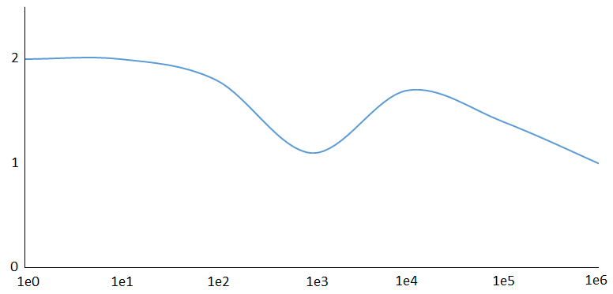
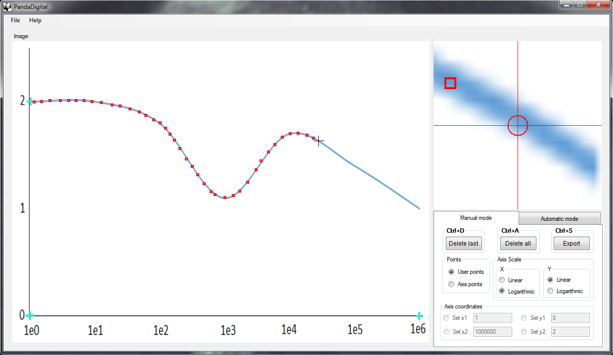
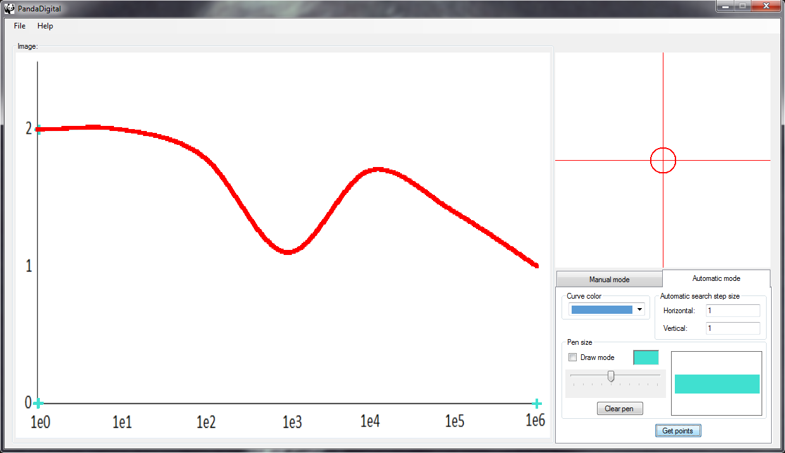

# PandaDigital

PandaDigital is a simple image digitizer tool that greatly reduces the time, effort and resources 
needed to extract plot's data from scanned images.

### Have you ever wanted to extract the points from a digitized graph like the one shown below,
to work with them or to create your own custom graph?

### PandaDigital allows you to achieve it in an easy way either manually:

### Or automatically:

## Features
- Automatic mode to extract plot's data based on selected curve color.
- Paint brush of adjustable thickness to delimit the automatic mode search space.
- User-friendly shortcuts to ease the extraction of data.

## Installation
You do not need to build PandaDigital. An executable file is in the bin folder

## Documentation
PandaDigital's documentation is included in this repo in the docs directory.

## Contributing
PandaDigital is an open source project. If you feel that PandaDigital or the community
will benefit from your changes, please open a pull request.

## Authors
Hugo Rodríguez Ignacio hugo.rodriguezignacio@gmail.com

## License
Code released under the MIT License.
Docs released under Creative Commons.
